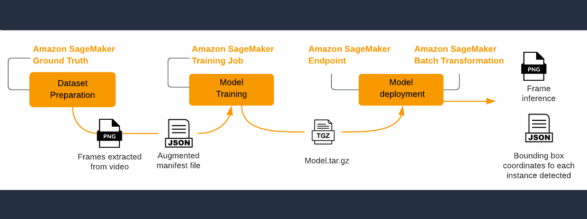
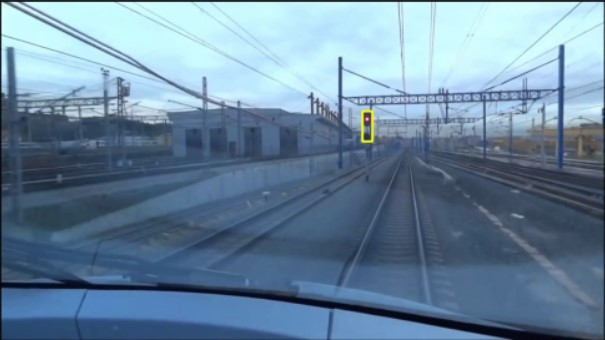

# Object Detection & Tracking for Railway Traffic Lights with Amazon SageMaker

1. [Overview](#Overview)
2. [Introduction](#Introduction)
3. [Labs](#Labs)
    1. [Setup](#Setup)
        1. [Prerequisites](#Prerequisites)
        2. [Start notebook](#Start-notebook)
    2. [LAB 1: Object detection with Detectron2](#LAB-1-Object-detection-with-Detectron2)
    3. [LAB 2: Object detection with GluonCV](#LAB-2-Object-detection-with-GluonCV)
    4. [LAB 3: Object tracking with GluonCV](#LAB-3-Object-tracking-with-GluonCV)
4. [Next Steps: MLOps](#Next-Steps-MLOps)
5. [Copyright](#Copyright)
6. [Security](#Security)
7. [License](#License)


## Overview

In this repository, we use [Amazon SageMaker](https://aws.amazon.com/sagemaker/) to build, train and deploy object detection and tracking models for the use case of railway traffic lights detection. 

It contains three labs that will help you to achieve the following:

- Follow the workflow for creating a machine learning model through:
    - Prepare the necessary dataset for the model training.
    - Apply transfer learning with pre-trained Object Detection and Object Tracking models.
    - Configure Amazon SageMaker Hyperparameter Optimization jobs.
    - Generate real-time predictions for any railway image using Amazon SageMaker Endpoints or batch predictions with Amazon SageMaker Transform Jobs.
- Use Object Detection models from Detectron2 and GluonCV models zoo on the traffic lights detection use case.
- Use Object Tracking models from GluonCV.
- Build Detectron2 Docker images and push them to [Amazon ECR](https://aws.amazon.com/ecr/) to run training and inference jobs on Amazon SageMaker.

## Introduction  

The **Deep Learning process** that will be carried out through the labs has three main steps:
 
**1. Dataset preparation**
 
To perform the training of a Deep Learning model, it is important to have a large, high-quality and labeled dataset. The data labeling process can be done using [Amazon SageMaker Ground Truth](https://aws.amazon.com/sagemaker/groundtruth/) through its graphical interface or programmatically in the jupyter notebook. You can see SageMaker Ground Truth [labeling jobs examples](https://github.com/aws/amazon-sagemaker-examples/tree/master/ground_truth_labeling_jobs) on the AWS Github.

The final results of the labeling job are the frames extracted from the videos (JPEG) and an output data file known as **augmented manifest file** which contains label data for each object that is sent to the labeling job and metadata about the label assigned to data objects. See [Amazon SageMaker documentation](https://docs.aws.amazon.com/sagemaker/latest/dg/sms-data-output.html#sms-output-box) for specification on bounding box annotations.


**2. Model training**

For the training job, the following labs use the transfer learning technique, which allows to work with a pre-trained model that is adapted to the new needs and given data.

As a result of the training job, a trained artifact model is obtained with the name of **model.tar.gz**. This file is stored in an S3 bucket.
    
 
**3. Model deployment** 

Once the trained artifact model has been generated, it can be deployed to get predictions in a hosting service or by a batch transformation. 
    
- **Amazon SageMaker hosting service**: allows to get one prediction in real time by hosting a persitent endpoint in which you can send a frame inference (e.g. JPEG) and get a bounding box coordinates for each class and instance detected.
    
- **Amazon SageMaker batch transformation**: allows to run an asynchronously batch inference job to get predictions based on a dataset.

These three steps are represented by the following diagram:




## Labs

### Setup

#### Prerequisites

To successfully execute the following labs, you will need:

- An AWS account
- An Amazon SageMaker Notebook Instance
- A S3 bucket

#### Start notebook

Create an Amazon SageMaker notebook instance with an EBS volume equal or bigger than 700 GB, and add the following lines to **start notebook** section of your life cycle configuration:

```
service docker stop
sudo mv /var/lib/docker /home/ec2-user/SageMaker/docker
sudo ln -s /home/ec2-user/SageMaker/docker /var/lib/docker
service docker start
```

This ensures that docker builds images to a folder that is mounted on EBS. Once the instance is running, open Jupyter lab, launch a terminal and clone this repository:

```
cd SageMaker
git clone https://github.com/rodzanto/amazon-sagemaker-pytorch-detectron2-frsign.git
cd amazon-sagemaker-pytorch-detectron2-frsign
```

### **LAB 1: Object detection with Detectron2**

#### **Overview**

This first lab is focused on the use case of object detection for Railway Traffic Lights using the **Detectron2 Computer Vision libray** and **PyTorch** to train and evaluate models using transfer learning on the **FRSign dataset**.  

[Detectron2](https://github.com/facebookresearch/detectron2) is an open-source project released by Facebook AI Research and built on top of PyTorch deep learning framework. Detectron2 makes easy to build, train and deploy state of the art object detection algorithms. Moreover, Detecron2’s design makes easy to implement cutting-edge research projects without having to fork the entire codebase. Detectron2 also provides a [Model Zoo](https://github.com/facebookresearch/detectron2/blob/master/MODEL_ZOO.md) which is a collection of pre-trained detection models we can use to accelerate our endeavour.

[FRSign](https://frsign.irt-systemx.fr/) is an open source dataset that contains a large-scale and accurate set of images for vision-based railway traffic light detection and recognition. Also, it provides annotations about relevant information like the bounding boxes.  

> This lab is an adaptation of the example [Detectron2 on SKU-110K dataset](https://github.com/aws-samples/amazon-sagemaker-pytorch-detectron2), now applied to the use case of traffic lights detection in railways with the FRSign dataset.


To execute this lab, complete the following steps: 

#### **Dataset Preparation**

The dataset to be used in this lab is the FRSign dataset. Due to the fact that the dataset is already labeled,  it will not be necessary to carry out the labeling process explained before. 

However, the dataset must be prepared for the Detectron2. For this purpose, follow the instruction in the [FRSign Detectron2 notebook](./amazon-sagemaker-pytorch-detectron2/frsign_doc_d2.ipynb) and use `conda_python3` as kernel to execute code cells. This notebook will guide you through the following process:

- Download the open FRSign dataset.
- Prepare the data for Detectron2 model:
    - Remove any images with a resolution different to 1920x1200 
    - Separate the data into three different channels: test, validation and training.
- Upload the data to an Amazon S3 bucket.
- Reorganise annotations for Detectron2 case and convert them to the manifest file format. 
    

At the end of the Dataset Preparation step, the **dataset** and the  **augmented manifest file** will be storaged in Amazon S3.

#### **Model training**

Once the dataset is prepared, the training will start through the transfer learning on the pre-trained object detection model.

1. Building the Training Container

     To train the model, a training container with the runtime dependencies and the [entry point script](/amazon-sagemaker-pytorch-detectron2/container_training/sku-110k/training.py) must be created. 
     
     For that, follow the instructions in the [Detectron2 on FRSign dataset notebook](./amazon-sagemaker-pytorch-detectron2/d2_custom_FRSign.ipynb) and use `conda_pytorch_p36` as kernel to execute code cells related to the `Setup part` and the `Building the Training Container part`. 
     
     This will create a Docker container with an AWS-authored Pytorch image and then, deploy it to Amazon Elastic Container Registry ("ECR").


2. Configure Amazon SageMaker Training job

    Follow the instructions in the [Detectron2 on FRSign dataset notebook](./amazon-sagemaker-pytorch-detectron2/d2_custom_FRSign.ipynb) and use `conda_python3` as kernel to execute code cells related to the `Training using Amazon SageMaker`. 
    
    When you run the notebook, the following will have been done:
    
    - Define the parameters to indicate where the dataset is stored (train, test and validations group data).
    - Define the container configuration.
    - Define the model hyperparameters .
    - Define the training job parameters.
    - Create the Estimator Object (also called as Amazon Sagemaker Training job object), which can start the training. 

3. Start the training

    The training will be started by calling the `fit` method of the Estimator Object.  Once the training is done, the Trained Model Artifact known as `model.tar.gz` will be generated. 

#### **Model deployment** 

To start making predictions with the generated model, it has to be deployed. This can be done with real-time inferences or batch inferences as well. You can execute any of them by following the instructions in the [Detectron2 on FRSign dataset notebook](./amazon-sagemaker-pytorch-detectron2/d2_custom_FRSign.ipynb) and use `conda_python3` as kernel to execute code cells related to the model deployment approach that you would like to select.


### **LAB 2: Object detection with GluonCV** 

#### **Overview**

This second lab is focused on the use case of object detection for Railway Traffic Lights using the **GluonCV Toolkit** for computer vision and the **Mxnet Framework** to train and evaluate models using transfer learning on the **FRSign dataset**. 

This lab serves as a comparison exercise between the model generated from Detectron2 (LAB 1) and the one generated by GluonCV.

[GluonCV](https://cv.gluon.ai/) provides implementations of state-of-the-art (SOTA) deep learning algorithms in computer vision. It aims to help engineers, researchers, and students quickly prototype products, validate new ideas and learn computer vision. Also provides a [Model Zoo](https://cv.gluon.ai/model_zoo/index.html) that goes from fundamental image classification, object detection, sementic segmentation and pose estimation, to instance segmentation and video action recognition.

> This lab is an adaptation of an example taken from the [MXNet GluonCV model-zoo: mobilenet](https://cv.gluon.ai/api/model_zoo.html#mobilenet), now applied to the use case of traffic lights detection in railways with the FRSign dataset. 

To execute this lab, complete the following steps:

#### **Dataset Preparation**
The dataset preparation model is the same as the carried out in the LAB 1.

> If you have not checked that dataset preparation process, you can visit the first lab.

#### **Model Training**
Once the dataset is prepared, the training will start through the transfer learning on the pre-trained object detection model, which will replace the last layer of the pre-trained network with a new output layer that predicts the railway traffic lights. 


1. To train the model, the training container must be created. However, unlike the first lab, in which the training container was built, this one will use an [AWS Deep Learning Container Image](https://aws.amazon.com/es/machine-learning/containers/), which is a pre-install Docket image that allows us to skip the complex process of creating the container environment from scratch. 

    For that, follow the instructions in the [Lab 2 - Object detection with GlounCV notebook](./amazon-sagemaker-mxnet-gluoncv/Lab2_object_detection-glounCV.ipynb) and use `conda_python3` as kernel to execute code cells. This will create the Estimator Object with the AWS Deep Learning Container Image configuration and start the process to fine-tuning SSD Mobilenet (MXNet GluonCV) with Amazon SageMaker.

    The container will have the [entry point script](./amazon-sagemaker-mxnet-gluoncv/entry_point/gluoncv_detect_ssd.py), which needs to be executed to start the model training.

    >For other purposes, visit the [Available Deep Learning Containers Images](https://github.com/aws/deep-learning-containers/blob/master/available_images.md)


#### **Model Deployment**

Execute the code cells of the Lab 2 - Object detection with GlounCV notebook related to the Deployment and inference phase. This will deploy an Amazon SageMaker Endpoint to generate real-time predictions on new images.
     
#### Detectron2 VS GluonCV 

After running both labs (LAB #1 and LAB #2), it is possible to observe that in some cases the model of the second lab could not detect relevant objects, while LAB #1, using the Detectron2 model, the results were more accurate.

> To improve the predictions of the second model, you could add more training time or make adjustments to the selected dataset.

### **LAB 3: Object tracking with GluonCV** 

#### **Overview**
This third lab will track an object using the [GluonCV's SiamRPN model](https://cv.gluon.ai/build/examples_tracking/demo_SiamRPN.html#sphx-glr-build-examples-tracking-demo-siamrpn-py) through the transfern learning process. [See an example of the expected result](./sample_media/atocha_cut.mp4)

To run the lab, follow the instructions in the [Lab 3 - Object tracking with GlounCV notebook](./amazon-sagemaker-mxnet-gluoncv/Lab3_object_tracking-glounCV.ipynb) to the object tracking process and use `conda_python3` as kernel to execute code cells. The notebook will guide you to the following steps:

- Take an example video and specify the coordinates of the object of interest in the first frame of the video (this is needed by the model). The coordinates show the region of interest where to track, and they are in the format of (min_x, min_y, width, height). 

    In this case, the coordinates belong to the traffic light that appears in the video.
- Load a pre-trained object tracking model from a model zoo through a script provided by GlounCv.
- Performn real-time inferences with sample frames to the pre-trained model.

The result will be a set of frames with the object of interest indicated inside a bounding box. Here is an example of one of the result boxes:



## Next Steps: MLOps

Once you successfully deploy your ML models, you could leverage [Amazon SageMaker for MLOps](https://github.com/aws/amazon-sagemaker-examples/blob/master/sagemaker-pipelines/tabular/customizing_build_train_deploy_project/sagemaker-pipelines-customized-project.ipynb) to create a CI/CD system that automate the process to build, train, and deploy models.


## Copyright

Be aware that the authors of the dataset provided it solely for academic and non-commercial purposes.

Please refer to the following [paper](https://arxiv.org/abs/1904.00853) for further details on the SKU-110k dataset:

```
@inproceedings{goldman2019dense,
 author    = {Eran Goldman and Roei Herzig and Aviv Eisenschtat and Jacob Goldberger and Tal Hassner},
 title     = {Precise Detection in Densely Packed Scenes},
 booktitle = {Proc. Conf. Comput. Vision Pattern Recognition (CVPR)},
 year      = {2019}
}
```

Please refer to the following [paper](https://arxiv.org/abs/2002.05665) for further details on the FRSign dataset:

```
@ARTICLE{2020arXiv200205665H,
       author = {{Harb}, Jeanine and {R{\'e}b{\'e}na}, Nicolas and {Chosidow}, Rapha{\"e}l and {Roblin}, Gr{\'e}goire and {Potarusov}, Roman and {Hajri}, Hatem},
        title = "{FRSign: A Large-Scale Traffic Light Dataset for Autonomous Trains}",
      journal = {arXiv e-prints},
     keywords = {Computer Science - Computers and Society, Computer Science - Computer Vision and Pattern Recognition, Computer Science - Machine Learning},
         year = "2020",
        month = "Feb",
          eid = {arXiv:2002.05665},
        pages = {arXiv:2002.05665},
archivePrefix = {arXiv},
       eprint = {2002.05665},
 primaryClass = {cs.CY},
       adsurl = {https://ui.adsabs.harvard.edu/abs/2020arXiv200205665H},
      adsnote = {Provided by the SAO/NASA Astrophysics Data System}
}
```


## Security

See [CONTRIBUTING](CONTRIBUTING.md#security-issue-notifications) for more information.

## License

This library is licensed under the MIT-0 License. See the LICENSE file.


